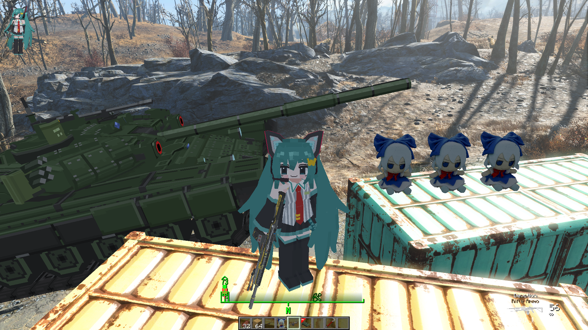

# FalloutCraft

**Play Fallout 4 as a Minecraft player.** A Fallout 4 + Minecraft crossover mod: Minecraft's
movement, inventory, building, hearts and combat inside the Commonwealth.


[](https://github.com/zeyvu/FalloutCraft/releases/latest)


<!-- Demo video: replace with a link to the YouTube video (or a GIF in docs/) when it's ready. -->

Walk, sprint and jump through Sanctuary with Minecraft's physics. Build a base out of Minecraft
blocks on top of Red Rocket. Fight raiders, mole rats and bloodbugs with a diamond sword, a bow
and a shield, while your Fallout S.P.E.C.I.A.L. makes Steve faster, stronger or tougher. Open the
Pip-Boy and listen to Diamond City Radio while you do it.

Neither game is rewritten. Minecraft runs its own game logic, and Fallout 4 runs its world, NPCs,
quests, Pip-Boy and saves. A Fallout 4 F4SE plugin and a Minecraft mod (Fabric on Minecraft 26.3, or NeoForge on
1.21.1) talk to each other
through shared memory. Minecraft runs hidden in the background, and Fallout draws everything.

**Latest: [v0.1.3 — Modded Minecraft Support](https://github.com/zeyvu/FalloutCraft/releases/tag/v0.1.3)**: FalloutCraft now
runs on **NeoForge 1.21.1** too, so you can bring your Minecraft mods (weapons, vehicles, furniture, player
models...) into the Commonwealth. Everything you know from the Fabric 26.3 build works there.

FalloutCraft is built on [SkyCraft](https://github.com/chasmlol/SkyCraft) by chasmlol, the
Skyrim + Minecraft mod (see [Credits](#credits)).

> **Status: early and experimental.** Expect rough edges, and back up your saves.
> This is a fan project. It isn't affiliated with Mojang, Microsoft, Bethesda or ZeniMax, and you
> need to own both games.

## What works

- **Movement:** Minecraft movement on Fallout's terrain, roads and buildings: walking,
  sprinting, jumping, crouching, swimming and falling. Fallout's collision (Havok) is streamed
  into Minecraft's own collision, and Fallout's ground under your feet is double-checked every
  frame so you don't fall through cracked roads.
- **Blocks:** place and break blocks anywhere in the Commonwealth. They're drawn inside Fallout's
  frame and hide behind Fallout's walls. Dropped items, arrows and block-breaking cracks are drawn
  too.
- **Combat:** hit Fallout's NPCs and creatures with any Minecraft weapon, including bows and
  tridents. Damage is scaled to the enemy's level. Enemies fight back, stagger on critical and
  knockback hits, and your kills count as yours.
- **Health:** Minecraft's hearts are your health. Fallout's damage (melee, bullets, bleeding) is
  sent to Minecraft, Minecraft's armour and shield reduce it, eating and natural regeneration heal
  you, and Fallout's health bar follows Minecraft's. If you die in Minecraft, you die in Fallout.
- **S.P.E.C.I.A.L.:** your Fallout stats shape your Minecraft body (5 is average; above is a
  bonus, below a penalty):

  | Stat | In Minecraft |
  |---|---|
  | Strength | Melee damage, knockback resistance |
  | Perception | Reach |
  | Endurance | Maximum health, breath under water, armour toughness |
  | Agility | Walking and running speed, attack speed, safer falls |
  | Luck | Minecraft's luck (better loot) |

- **Pip-Boy:** Tab opens the Pip-Boy as usual, radio included.
- **Camera:** Minecraft's F5 camera modes (behind and in front) show your Minecraft skin and
  armour in Fallout. Fallout's own first-person arms are hidden.
- **Interiors:** every interior and every other worldspace gets its own place in the Minecraft
  world, so what you build in one never shows up in another.
  Interior walls, floors and doors line up with Fallout's own (fixed in v0.1.1).
- **Minecraft nights:** Minecraft's clock follows Fallout's. From 20:00 to 5:00, zombies,
  skeletons and creepers show up around you outdoors, alongside the Wasteland's own mutants.
  Zombies and skeletons burn at dawn, and creepers blow holes in the ground.
- **Scavenging:** the first time you open a container (a desk, a toolbox, a fridge...) or search
  a corpse, you also find a little everyday Minecraft loot: sticks, coal, iron nuggets, paper,
  string, torches, bread, bones, arrows, leather, saplings and seeds... ("Found! ..." in the chat).
- **Gathering:** mine the world like in Minecraft. Chop a tree and it falls out of Fallout's world,
  giving you logs and often a sapling; small rocks give stone; dig the Wasteland's ground for dirt,
  then about a dozen layers of stone with ores (coal, iron, copper, redstone, gold, lapis, the
  rare diamond) before bedrock. You can climb down into the holes you dig.
- **NPCs vs your builds:** the blocks you place are solid for Fallout too, so NPCs and creatures
  bump into your walls instead of walking through them. (They still plan their routes as if the
  blocks weren't there.)
- **Minecraft mods (NeoForge 1.21.1):** play with other Minecraft mods installed. Their blocks,
  items, mobs, vehicles and player models are drawn in Fallout like Minecraft's own. Tested with
  Superb Warfare (guns and vehicles), GeckoLib mods, Yes Steve Model and Fumo plushies (see
  [Minecraft 1.21.1](#minecraft-1211)).

## Requirements

**Fallout 4**

| | |
|---|---|
| Fallout 4 (Steam), current runtime | Developed and tested on **1.11.240**. The old-gen 1.10.163 runtime isn't supported. |
| [Fallout 4 Script Extender (F4SE)](https://f4se.silverlock.org/) ([Nexus](https://www.nexusmods.com/fallout4/mods/42147)) | For your game version (tested with 0.7.9) |
| [Address Library for F4SE Plugins](https://www.nexusmods.com/fallout4/mods/47327) | The "All in One" file for your game version |

> **Recommended:** play from a save made after you leave Vault 111. The opening (the pre-war
> house and the vault) is heavily scripted and may not work while Minecraft drives the player.

**Minecraft**

| | |
|---|---|
| Minecraft: Java Edition | A Microsoft account that owns it |
| Minecraft 26.3 with [Fabric Loader](https://fabricmc.net/) 0.19.5 or newer | Started from this repo with `gradlew runClient` (see below) |
| [Fabric API](https://modrinth.com/mod/fabric-api) for 26.3 (Fabric only) | Pulled in by the build |
| Java 25 (JDK) | To build and run the Minecraft mod |
| *Or* Minecraft **1.21.1** with [NeoForge](https://projects.neoforged.net/neoforged/neoforge) 21.1.x and Java 21 | To play with other Minecraft mods; see [Minecraft 1.21.1](#minecraft-1211) |

Minecraft runs hidden next to Fallout. Budget about 3 GB of extra RAM and a GPU that runs
Minecraft 26.3.

**To play** you also need **JDK 25** (it runs the Minecraft mod) and **Git** (or download this
repo as a ZIP from GitHub).

**To build the plugin yourself** (optional: a compiled one comes with the repo):

| | |
|---|---|
| [Visual Studio](https://visualstudio.microsoft.com/) 2022 or newer | With the **Desktop development with C++** workload (the MSVC compiler) |
| [xmake](https://xmake.io/) | Builds the Fallout 4 plugin |
| [Git](https://git-scm.com/) | To clone this repo and the CommonLibF4 template |

## Installing

### Quick install (from Releases)

No Git or build tools needed. Grab the files from the
[latest release](https://github.com/zeyvu/FalloutCraft/releases/latest):

1. Install **F4SE** and the **Address Library** (see [Fallout 4 mods](#1-fallout-4-mods) below).
2. Install **`FalloutCraft-<version>-FO4.zip`** with Mod Organizer 2 / Vortex (*Install mod from
   archive*), or copy **`commonlibf4-template.dll`** into `Fallout 4\Data\F4SE\Plugins\`.
3. In your Minecraft launcher (Prism Launcher, MultiMC, Modrinth App, official) make a
   **Minecraft 26.3 + Fabric Loader 0.19.5** instance running **Java 25**, and put **Fabric API
   0.161.0+26.3** and **`falloutcraft-<version>.jar`** in its `mods` folder.

   Or a **Minecraft 1.21.1 + NeoForge 21.1.x** instance (CurseForge, Prism...) running **Java 21**
   with **`falloutcraft-neoforge-<version>+1.21.1.jar`** in its `mods` folder (see
   [Minecraft 1.21.1](#minecraft-1211)). CurseForge's app lists only mods from its own catalog;
   a jar you add yourself still loads.
4. Start that Minecraft instance first (its window hides and it waits for Fallout), then start
   Fallout 4 through F4SE and load a save.

### Full install (from the repo)

The repo comes with the plugin already compiled, so you don't need to build anything to play.
(If you'd rather build it yourself, see [Building from source](#building-from-source).)

#### 1. Fallout 4 mods

Install these first, with your mod manager (Mod Organizer 2, Vortex) or by hand:

1. **F4SE:** copy `f4se_loader.exe`, the `f4se_1_*.dll` files and the `Data` folder from the F4SE
   archive into your Fallout 4 folder (where `Fallout4.exe` is). From now on, start the game with
   `f4se_loader.exe` (or through your mod manager).
2. **Address Library for F4SE Plugins:** its `.bin` file goes into
   `Fallout 4\Data\F4SE\Plugins\`.

#### 2. Get FalloutCraft

```bat
git clone https://github.com/zeyvu/FalloutCraft
```

(or **Code > Download ZIP** on GitHub and unzip it).

#### 3. Install the plugin

Copy **`FO4_Release\Data\F4SE\Plugins\commonlibf4-template.dll`** into
**`Fallout 4\Data\F4SE\Plugins\`** (next to the Address Library's `.bin`). That's the FalloutCraft
plugin; F4SE loads it when the game starts.

> With Mod Organizer 2 or Vortex: zip the `FO4_Release\Data` folder (so the zip has `Data` at its
> top) and install the zip as a mod.

#### 4. Start Minecraft

```bat
cd FalloutCraft\fabric
gradlew runClient
```

That builds the FalloutCraft Minecraft mod and starts Minecraft with it. The first run downloads
Minecraft 26.3, Fabric and the Fabric API (a few minutes). Minecraft hides its window and waits
for Fallout. Leave it running.

On Minecraft 1.21.1 with NeoForge instead: same command in `versions\1.21.1\neoforge`.

#### Minecraft 1.21.1

Most Minecraft mods and modpacks are on 1.21.1, so FalloutCraft has a **NeoForge 1.21.1** build
too (since v0.1.3). It does everything the Fabric 26.3 build does: movement and collision in
Fallout's world, combat, night mobs, scavenging, gathering and digging, your blocks and builds,
Minecraft mobs, items and particles in Fallout, your skin in F5, and the inventory, hand and HUD
over Fallout.




**Other mods:** put them in the same `mods` folder as FalloutCraft. What they add to Minecraft's
world (blocks, items, mobs, vehicles, guns, player models) is drawn in Fallout too. Good to know:

- Mods that add lots of textures make Minecraft's texture atlas big (8192 pixels wide with Superb
  Warfare). It's sent to Fallout in pieces, so the first seconds after loading can take a moment.
- Mods that draw with their own shaders or special effects (glow, outlines, custom GUIs inside the
  world) may show up plainer in Fallout, or not at all.
- Shader packs (Iris, Oculus) and mods that replace Minecraft's renderer (Sodium-style) aren't
  supported: Fallout draws the world, not Minecraft.
- Mods that take over the player's camera or movement will conflict.

#### 5. Play

1. With Minecraft running, start **Fallout 4 through F4SE** (`f4se_loader.exe` or your mod
   manager) and load a save.
2. The two find each other on their own: Minecraft opens its FalloutCraft world, moves to where
   your Fallout character stands, and takes over. You'll see Minecraft's hotbar and hearts over
   Fallout.

The order doesn't matter, and either side can be restarted: they reconnect.

To check the plugin loaded, open `Documents\My Games\Fallout4\F4SE\commonlibf4-template.log`:
it starts with `SkyCraft (FalloutCraft) plugin build <date> <time>`.

### Updating

`git pull` (or download the ZIP again), copy the new `commonlibf4-template.dll` over the old one,
and start Minecraft again with `gradlew runClient` (it rebuilds the mod). Update both halves
together: they share a memory layout and only talk to a matching version.

### Uninstalling

Delete `Fallout 4\Data\F4SE\Plugins\commonlibf4-template.dll`. FalloutCraft doesn't change your
Fallout saves beyond what you did while playing.

## Controls

Minecraft has priority. These keys still go to Fallout:

| Key | Does |
|---|---|
| **E** | Fallout activate: doors, NPCs (talk), containers, terminals, workbenches |
| **Tab** | Pip-Boy |
| **Esc** | Fallout pause menu (or closes an open Minecraft screen) |
| **~** | Fallout console |
| **F9** | Fallout quickload |

And these are Minecraft's, moved or changed for Fallout:

| Key | Does |
|---|---|
| **I** | Minecraft inventory (E is Fallout's activate) |
| **Shift** | Sprint |
| **Ctrl** | Crouch / sneak |
| **O** | Minecraft pause / options menu |

Every other key is Minecraft's: **F5** camera, **T** chat, **/** commands, the hotbar keys, the
mouse buttons and so on.

## Known limitations

- If something goes wrong, the logs say what:
  - `Documents\My Games\Fallout4\F4SE\commonlibf4-template.log` (the Fallout plugin)
  - `Documents\My Games\Fallout4\F4SE\SkyCraft_crash.log` (crashes, with function names)
  - `fabric\run\logs\latest.log` (Minecraft), or `logs\latest.log` in your launcher's instance
    folder (CurseForge, Prism...)
- Some cracked or uneven ground (Concord's broken roads, rubble) can still make the player stumble
  for a moment.
- Fallout's inventory and perk screens open through the Pip-Boy; Fallout's weapons and VATS can't
  be used while Minecraft drives the player.
- Fallout's stimpaks and food don't heal Minecraft's hearts yet; eat Minecraft food.
- Charisma and Intelligence don't change anything in Minecraft yet.
- Not ported from SkyCraft yet: digging into the world itself, Minecraft lights lighting Fallout,
  Minecraft water, NPCs walking around blocks, training Fallout skills from Minecraft play, and
  multiplayer.
- `FalloutCraft_worlds.txt` (next to the logs) remembers where each interior lives in the
  Minecraft world. Deleting it moves interiors around, and what you built inside them won't show
  up in the same place.
- Mods that also take over the player's camera or movement will conflict.
- Minecraft blocks and models are lit with an approximation of Fallout's light (sun, sky, fog),
  not by Fallout's own lighting yet: no shadows cast by them, and their shading won't always match
  Fallout's surfaces exactly.

## Building from source

Only needed if you change the plugin or want to compile it yourself.

The plugin is built on the
[CommonLibF4 plugin template](https://github.com/libxse/commonlibf4-template). The template is a
separate project with its own license, so this repo doesn't include it: `FO4_ModFiles/` has only
FalloutCraft's own files. You clone the template, drop them in, and build. With
`XSE_FO4_GAME_PATH` set, the build also copies the plugin straight into the game.

In a terminal (cmd), inside the `FalloutCraft` folder:

```bat
:: the CommonLibF4 template (with its submodules), inside the FalloutCraft folder
git clone --recurse-submodules https://github.com/libxse/commonlibf4-template

:: FalloutCraft's sources into the template's src\, and its build file over the template's
copy /Y FO4_ModFiles\*.cpp commonlibf4-template\src\
copy /Y FO4_ModFiles\*.h commonlibf4-template\src\
copy /Y FO4_ModFiles\xmake.lua commonlibf4-template\xmake.lua

:: your Fallout 4 folder (the one with Fallout4.exe), so the build installs into it
setx XSE_FO4_GAME_PATH "C:\Games\Fallout 4"
```

`FO4_ModFiles\xmake.lua` is the template's build file plus the Direct3D and DbgHelp libraries the
plugin needs (without them it doesn't link) and a `.pdb` for the crash log.

Close the terminal and open a new one (so it sees `XSE_FO4_GAME_PATH`), then:

```bat
cd FalloutCraft\commonlibf4-template
xmake build -r
```

The first build downloads CommonLibF4's dependencies and takes a few minutes. It ends with:

```
installing commonlibf4-template to C:\Games\Fallout 4\Data ..
install ok!
[100%]: build ok
```

That built `commonlibf4-template.dll` in `commonlibf4-template\build\windows\x64\release\` and
copied it to `Fallout 4\Data\F4SE\Plugins\`. Without `XSE_FO4_GAME_PATH`, copy it there yourself
(the `.pdb` next to it is optional; it lets the crash log name functions). To update the compiled
copy in the repo, copy it to `FO4_Release\Data\F4SE\Plugins\`.

The `commonlibf4-template` folder is ignored by Git: only FalloutCraft's own files are in this
repo.

For development:

- `fabric\gradlew runClient` starts a dev Minecraft that stays running when Fallout closes;
  `gradlew build` builds the mod's `.jar` into `fabric\build\libs\`.
- NeoForge 1.21.1: `versions\1.21.1\neoforge` (`gradlew runClient`, `gradlew build` ->
  `build\libs\falloutcraft-neoforge-<version>+1.21.1.jar`). It compiles the same shared code for
  1.21.1 and adds NeoForge's entry point and glue (`src\main\java\dev\skycraft\neoforge`). Code
  that talks to the mod loader goes through `dev.skycraft.platform.Platform` (Fabric's side in
  `dev.skycraft.fabric`).
- How one copy of the code serves every build: it's written for Fabric + Minecraft 26.3 (that build
  compiles it as it is). Differences go between `//#if MC_1_21_1` / `//#if FABRIC` /
  `//#if NEOFORGE` ... `//#else` ... `//#endif`, with the other targets' lines written as
  `//$$ code`; the other builds make their own copy (`gradle/preprocess.gradle`), which also
  renames `Identifier` to 1.21.1's `ResourceLocation`. Files that are mostly different on 1.21.1
  live in `versions\1.21.1\common` (they replace the shared one), and
  `versions\1.21.1\exclude.txt` lists what 1.21.1 leaves out for now. `python tools\preprocess.py
  check` checks the rules; `python tools\preprocess.py gen <target> <folder>` writes a build's copy.
- `docs\DESIGN.md` explains how the two halves fit together (written for SkyCraft), and
  `protocol\skycraft_protocol.h` is the shared-memory layout both sides follow
  (`FO4_ModFiles\skycraft_protocol.h` is the same file).

| Folder | |
|---|---|
| `FO4_Release/` | The compiled plugin, laid out like the game's `Data` folder |
| `FO4_ModFiles/` | The plugin's sources (C++, [CommonLibF4](https://github.com/libxse/commonlibf4)) and its `xmake.lua`, to drop into the CommonLibF4 template |
| `fabric/` | The Minecraft mod (Java), from SkyCraft with FalloutCraft changes: its Fabric 26.3 build, and the code shared with NeoForge 1.21.1 |
| `versions/1.21.1/` | The NeoForge 1.21.1 build (`neoforge/`) and the 1.21.1-only files (`common/`) |
| `gradle/`, `tools/` | The shared-code preprocessor, release packaging |
| `protocol/` | `skycraft_protocol.h`: the shared-memory layout both sides follow |
| `docs/` | `DESIGN.md` explains how the two halves fit together (written for SkyCraft) |

## Credits

FalloutCraft stands on [SkyCraft](https://github.com/chasmlol/SkyCraft) by
[chasmlol](https://github.com/chasmlol), which brought Minecraft into Skyrim. Go and see it.

- **From SkyCraft:** the idea, the two-games-over-shared-memory design, the shared-memory protocol
  and the Minecraft Fabric mod. SkyCraft's original README is kept as
  [READMEOriginal.md](READMEOriginal.md).
- **New in FalloutCraft:** the whole Fallout 4 F4SE plugin (`FO4_ModFiles/`): driving Fallout's
  player, streaming Fallout 4's Havok collision, drawing Minecraft's blocks, items and HUD in
  Fallout's renderer, the Pip-Boy hand-over, the F5 cameras, combat with Fallout's actors, separate
  interiors and worldspaces. In the Minecraft mod: Fallout's ground as a safety net under the
  player, health shared with Fallout, S.P.E.C.I.A.L. attributes, and armour and shields against
  Fallout's gunfire.

## License

[MIT](LICENSE)
