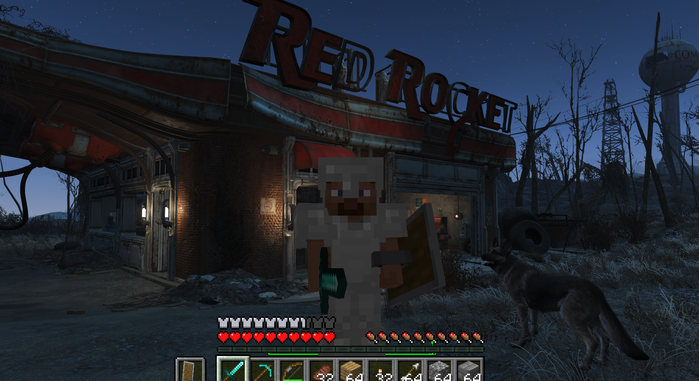

# SkyCraft



Play Skyrim as a Minecraft player. You move with Minecraft's physics, carry Minecraft's inventory
and HUD, and place and break blocks in Skyrim's world. You fight Skyrim's NPCs with Minecraft
weapons, and they fight back.

Neither game is rewritten. Minecraft runs its own game logic, and Skyrim runs its world, NPCs,
quests and saves. A Skyrim SKSE plugin and a Minecraft Fabric mod talk to each other through
shared memory. Minecraft runs hidden in the background, and Skyrim draws everything.

> **Status: early and experimental.** Expect rough edges, and back up your saves.
> This is a fan project. It isn't affiliated with Mojang, Microsoft, Bethesda or ZeniMax, and you
> need to own both games.

## What works

- **Movement:** Minecraft movement on Skyrim's terrain and buildings. That covers walking,
  sprinting, jumping, crouching, swimming and falling, and Skyrim's collision is fed into
  Minecraft's own collision.
- **Blocks:** place and break blocks anywhere in Skyrim. They're drawn inside Skyrim's frame
  with its sun, shadows, fog and weather. Minecraft lights (torches, lava, glowstone and so on)
  light up Skyrim.
- **Digging into Skyrim:** mine Skyrim's ground, rocks, roads and objects like Minecraft blocks.
  What you dig out drops as the block it's made of (dirt under grass, then stone with ores, then
  bedrock), and the hole is real for you, NPCs and items. TNT, creepers and other explosions blow
  craters into Skyrim. Interiors and caves are solid stone behind their walls. What you dig is
  saved in your Minecraft world. **Skyrim destruction: On/Off** in the top left of the pause menu
  (O) turns it off (holes already dug stay).
- **Block entities:** chests, beds, banners, heads, shulker boxes and similar blocks are drawn,
  and pistons move blocks.
- **Water and lava:** they flow over Skyrim's terrain, and Skyrim water swims like Minecraft
  water.
- **Combat:** hit Skyrim NPCs with any Minecraft weapon, including bows, tridents and TNT.
  Damage is scaled to NPC level, and NPCs fight back.
  - NPCs collide with blocks and path around them.
  - Lava and fire hurt NPCs, and NPCs press pressure plates.
- **Skyrim progression:**
  - Your Skyrim skills level up from Minecraft play. Swords, maces and tools train
    One-Handed; axes and spears train Two-Handed; bows and anything thrown train Archery.
  - Shields train Block, and hits taken train Light or Heavy Armor depending on what you wear.
  - Crafting gear trains Smithing, and crouching is Skyrim sneak, which trains Sneak.
- **Camera and death:** Minecraft's F5 camera modes show your skin and armor in Skyrim. Dying
  gives Skyrim's death camera with your Minecraft body ragdolling.
- **Skyrim's own animations:** chairs, crafting stations, beds, pull levers, horses and scripted
  scenes hand control to Skyrim until they finish.
- **Multiplayer (Minecraft side only):** friends who also run SkyCraft can join your Minecraft
  world over the internet (see [Playing with friends](#playing-with-friends)).

## Requirements

**Skyrim**

| | |
|---|---|
| Skyrim Special Edition, **Anniversary Edition runtime** (1.6.x / 1.7.x) | Developed and tested on **1.7.104**. Not SE 1.5.97, not VR. |
| [SKSE64](https://skse.silverlock.org/) | For your game version |
| [Address Library for SKSE Plugins](https://www.nexusmods.com/skyrimspecialedition/mods/32444) | The "All in one (Anniversary Edition)" file |

> **Heavily recommended: [Alternate Start - Live Another Life](https://www.nexusmods.com/skyrimspecialedition/mods/272).**
> Skyrim's opening (the cart ride and Helgen) is heavily scripted and may not work with SkyCraft,
> so you can get stuck. Alternate Start skips it and lets you choose where your new character
> begins. Otherwise, play from a save made after Helgen.

**Minecraft**

You only need **a Microsoft account that owns Minecraft: Java Edition**. SkyCraft comes with
everything else: a portable [Prism Launcher](https://prismlauncher.org/) set up with Minecraft 26.3,
[Fabric](https://fabricmc.net/), [Fabric API](https://modrinth.com/mod/fabric-api) and the SkyCraft
Minecraft mod. Prism downloads Minecraft and Java itself.

Minecraft runs hidden next to Skyrim. Budget about 3 GB of extra RAM, about 1.5 GB of disk for
Minecraft's own files, and a GPU that runs Minecraft 26.3.

## Installing

1. **Install `SkyCraft-<version>.zip`** with Mod Organizer 2 or Vortex, like any SKSE plugin.
2. **Start Skyrim through SKSE.** The first time, SkyCraft unpacks its Minecraft to
   `%LOCALAPPDATA%\SkyCraft` and a small **Prism Launcher** window asks you to sign in with your
   Microsoft account. Alt-Tab to it, sign in, then go back to Skyrim. Prism downloads Minecraft,
   Fabric and Java (a few minutes, first time only), and Skyrim's corner messages tell you when
   Minecraft is ready.
3. **After that it's automatic.** Minecraft starts with Skyrim with no window and no sound, opens
   its SkyCraft world by itself (a new Survival world, created on your PC), and quits when Skyrim
   closes.

Updating: install the new SkyCraft zip over the old one. The next start updates the Minecraft side
too and keeps your sign-in and your world.

Uninstalling: remove the mod, then delete `%LOCALAPPDATA%\SkyCraft`. That folder holds Prism, your
Microsoft sign-in (Prism's), Minecraft's files and your SkyCraft world.

### Using your own launcher

`Data/SKSE/Plugins/SkyCraft.ini` can point SkyCraft at your own Prism, MultiMC or `.bat` file instead:

```ini
[Minecraft]
bStartWithSkyrim = 1              ; 0: start Minecraft yourself, any way you like
sLauncher =                       ; empty: the Minecraft that comes with SkyCraft
sArguments = --launch SkyCraft    ; what your launcher needs to start the SkyCraft instance
```

Your instance needs Minecraft 26.3, Fabric Loader 0.19.5 or newer, Fabric API, Java 25 and
`skycraft-fabric-<version>.jar` (from the release), plus `-Dskycraft.startHidden=true` in its
JVM arguments if it should stay hidden from the start. SkyCraft never starts a second Minecraft if
one with the mod is already running. It starts Minecraft through Windows' shell, so under Mod
Organizer Minecraft stays outside MO2's virtual file system and doesn't keep MO2 locked.

## Playing with friends

Everyone needs their own Skyrim with SkyCraft. Only the Minecraft world is shared: blocks, items,
mobs and each other. Up to 100 players. Each player keeps their own Skyrim world, NPCs and quests.

1. **Host:** press **O** (Minecraft's menu), choose **Open to LAN**, then **Start LAN World**.
   SkyCraft's bundled [e4mc](https://modrinth.com/mod/e4mc) puts a link like `abc-def.e4mc.link`
   in chat. Click it to copy it, then send it to your friends.
2. **Friends:** press **T** and type `/join abc-def.e4mc.link`. Your Minecraft leaves its own
   world and joins the host's.
3. **`/leave`** goes back to your own world. If the host closes their world, you're put back in
   yours automatically.

**With Discord:** your Discord status shows SkyCraft while you play. Once you've opened your world
to LAN it has a **Join** button (and you can invite friends from a Discord chat). A friend with
Skyrim and SkyCraft already running clicks it and joins you, no link needed.

## Controls

Minecraft has priority. These keys still go to Skyrim:

| Key | Does |
|---|---|
| **G** | Skyrim activate: doors, NPCs (talk), containers, levers, furniture |
| **Esc** | Skyrim menu (or closes an open Minecraft screen) |
| **J** / **M** | Skyrim journal / map |
| **H** | Skyrim wait |
| **F9** | Skyrim quickload (save from the Esc menu) |
| **~** | Skyrim console |
| **O** | Minecraft pause / options menu |

Every other key is Minecraft's: **E** inventory, **F5** camera, **T** chat, **/** commands,
**Shift** crouch/sneak, and so on.

## Known limitations

- If something goes wrong, `Documents\My Games\Skyrim Special Edition\SKSE\SkyCraft.log` says what.
  For bug reports, set `bDiagnostics = 1` in `SkyCraft.ini` for detailed logs.
- **Stuck on "SkyCraft: starting Minecraft..."?** After a minute SkyCraft says which of these it is:
  - Prism Launcher is still busy. Alt-Tab to it: it may be downloading, or need you to sign in,
    or show an error.
  - Minecraft closed. Its log is
    `%LOCALAPPDATA%\SkyCraft\Prism\instances\SkyCraft\.minecraft\logs\latest.log`.
  - Minecraft is running but not responding. Please report it, with `SkyCraft.log` and that
    `latest.log`.

  You need to own Minecraft: Java Edition.

- Skyrim's opening (cart ride and Helgen) may leave you stuck. Use
  [Alternate Start](https://www.nexusmods.com/skyrimspecialedition/mods/272) or a save made after Helgen.
- Skyrim's inventory, magic, shouts and perks can't be opened while Minecraft drives the player.
- Minecraft hits only reach NPCs, not Skyrim objects such as the web around Arvel in Bleak Falls
  Barrow. There's no in-game switch back to plain Skyrim yet. Closing Minecraft hands control
  back to Skyrim; Minecraft keeps what it last autosaved, every few minutes. Deal with the object,
  then restart Skyrim to bring Minecraft back.
- Sign text isn't drawn yet.
- All Skyrim interiors share one Minecraft world, so blocks placed in one interior can appear in
  another at the same coordinates.
- Multiplayer syncs only the Minecraft world. Each player has their own Skyrim, and guests
  can't hit their own Skyrim NPCs yet.
- Mods that also take over the camera (Improved Camera SE, SmoothCam, True Directional Movement)
  will conflict.

## Building from source

You need Visual Studio 2026 (C++), CMake 3.25+, Git, and JDK 25.

```bat
git clone --recursive <this repo> skycraft
cd skycraft
git clone https://github.com/microsoft/vcpkg .tools\vcpkg
.tools\vcpkg\bootstrap-vcpkg.bat

cd skse
cmake --preset default
cmake --build --preset release

cd ..\fabric
gradlew build

cd ..
powershell -ExecutionPolicy Bypass -File tools\package.ps1 -NoBuild
```

`tools\package.ps1` builds both halves (drop `-NoBuild`) and writes the release files to `dist\`.

For development:

- `fabric\gradlew runClient` starts a dev Minecraft that stays running when Skyrim closes.
- With `SKYCRAFT_DEPLOY_DIR` (preset default: the MO2 mod folder `mods\SkyCraft`, if it exists),
  each plugin build is copied straight into Mod Organizer.
- `docs\DESIGN.md` explains how the two halves fit together, and `protocol\skycraft_protocol.h`
  is the shared-memory layout both sides follow.

| Folder | |
|---|---|
| `skse/` | The Skyrim SKSE plugin (C++, [CommonLibSSE-NG](https://github.com/alandtse/CommonLibVR/tree/ng)) |
| `fabric/` | The Minecraft Fabric mod (Java) |
| `protocol/` | The shared-memory protocol between them |
| `tools/` | Packaging, test stand-ins (`fake_skyrim.py`, `fake_guest.py`) and diagnostics |

## License

[MIT](LICENSE)
